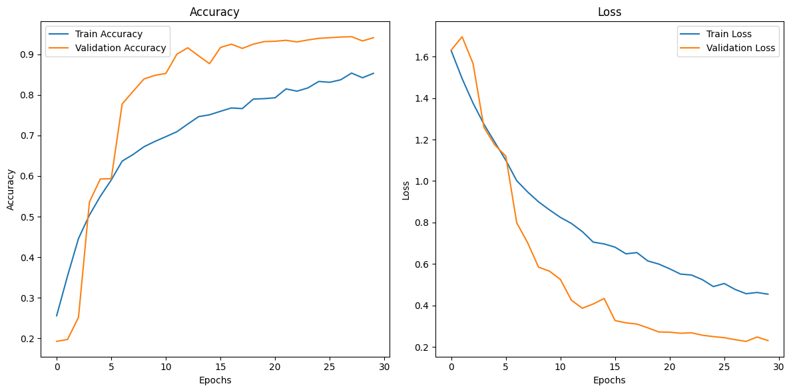

# Classification d'Images de Nourriture avec EfficientNetB2

Ce projet implémente une classification d'images de nourriture en utilisant le modèle pré-entraîné **EfficientNetB2**. L'objectif est de prédire l'une des 5 classes cibles basées sur des images d'aliments.

## 📂 Dataset Utilisé

Le dataset utilisé pour ce projet est une version filtrée de [Food-101 Dataset](https://data.vision.ee.ethz.ch/cvl/datasets_extra/food-101/). Parmi les 101 classes disponibles dans Food-101, nous avons sélectionné **5 classes spécifiques** pour cette tâche :

- **steak**
- **tacos**
- **pizza**
- **donuts**
- **tiramisu**

### Organisation du Dataset
Le dataset est divisé en deux sous-ensembles :
- **Entraînement** : utilisé pour ajuster les paramètres du modèle.
- **Test** : utilisé pour évaluer la performance finale du modèle.

Les images sont prétraitées avec :
- Redimensionnement à une taille de **224x224 pixels**.
- Normalisation des valeurs des pixels entre **0 et 1**.

Des augmentations de données telles que la rotation aléatoire, le zoom aléatoire et le retournement horizontal ont été utilisées pour améliorer la robustesse du modèle.

## 🧠 Modèle Utilisé

### Base du Modèle
Le modèle repose sur **EfficientNetB2**, un réseau neuronal convolutif pré-entraîné sur ImageNet. EfficientNet est reconnu pour son efficacité et sa précision élevées tout en maintenant un faible coût computationnel.

### Structure du Modèle
Le modèle final est composé des couches suivantes :
1. **EfficientNetB2** (pré-entraîné) comme extracteur de caractéristiques.
2. **Global Average Pooling** pour réduire la dimensionnalité des caractéristiques.
3. **Dropout (0.3)** pour éviter le surapprentissage.
4. **Dense (Softmax)** avec 5 neurones correspondant aux 5 classes cibles.

Le modèle a été entraîné avec :
- Optimiseur : **Adam** avec un learning rate de `1e-5`.
- Fonction de perte : **Sparse Categorical Crossentropy**.
- Mesure : **Exactitude (Accuracy)**.

## ⚙️ Environnement et Bibliothèques

### Bibliothèques Principales
- `TensorFlow` : pour construire et entraîner le modèle.
- `NumPy` : pour la manipulation de données.
- `Matplotlib` : pour visualiser les résultats.

## 🎯 Performance du Modèle

Après un entraînement de **30 époques**, le modèle atteint une **précision de 94%** sur l'ensemble de test. Cela démontre l'efficacité d'EfficientNetB2, même sur un dataset filtré et de taille réduite.

## 📊 Courbes d'Apprentissage

Les courbes d'apprentissage ci-dessous montrent la précision et la perte pendant l'entraînement et test:

